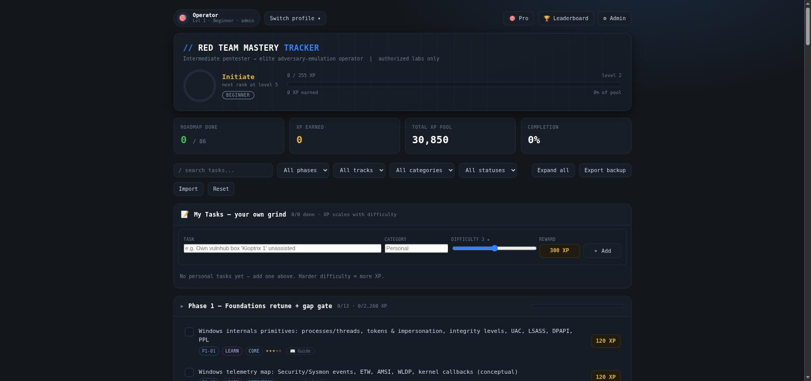
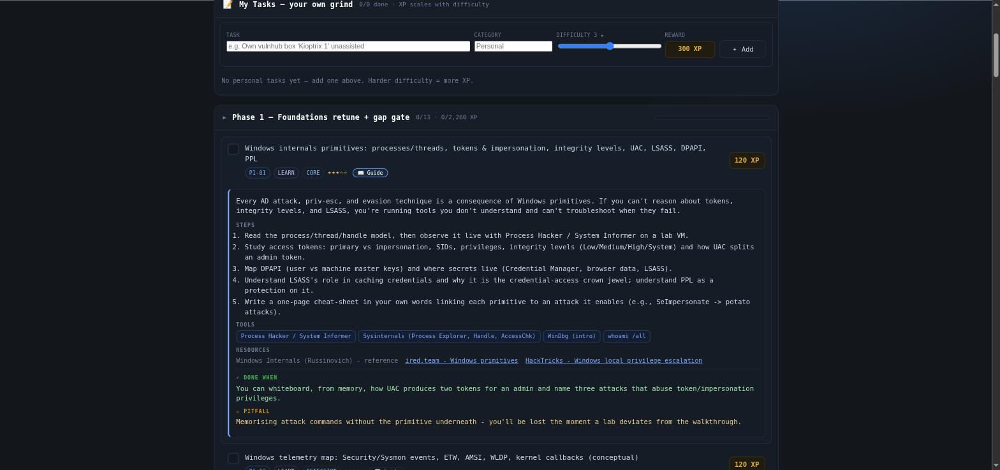
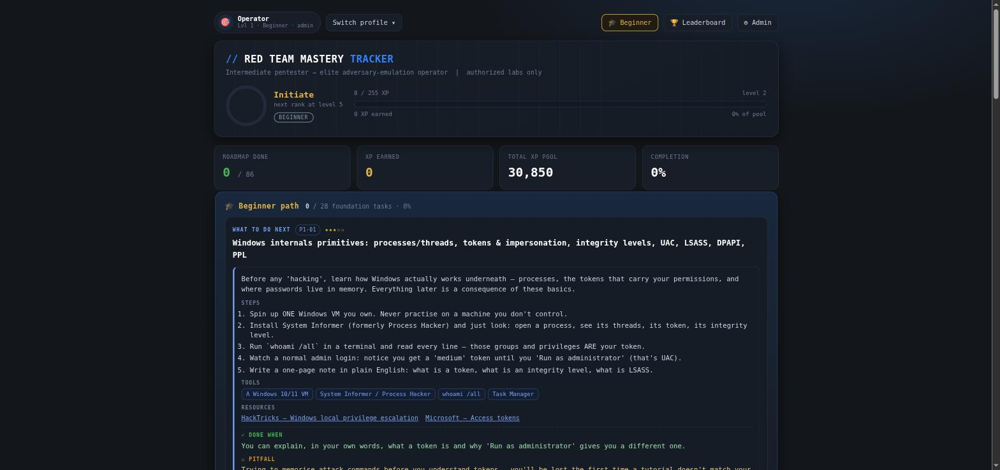

# Red Team Mastery Tracker

Gamified, **multi-profile** progress tracker for the intermediate-pentester → elite-red-teamer roadmap.
Self-contained local web app — XP, levels, ranks, leagues, achievements, trophies, weekly challenges,
an admin panel, and per-user profiles. **No backend, no internet, no build step to run it.**

**86 roadmap tasks · 30,850 total XP · 30 levels · 7 operator ranks · 8 league tiers · 12 achievements · 11 built-in trophies.**

## Screenshots

**Pro dashboard** — the full roadmap: XP pool, rank/level, completion, and every phase with per-task Guide panels.


**Per-task guide** — click **📖 Guide** on any task for an inline walk-through: overview, steps, tools, resources, "done when", and the common pitfall.


**Beginner path** — a guided view that shows only the foundation phases with a "what to do next" card and a plain-English guide on each task. Toggle **🎯 Pro / 🎓 Beginner** in the top bar.


## Files
| File | What it is |
|---|---|
| `index.html` | Self-contained local web app. Just open it. All state lives in your browser's localStorage. |
| `resources.html` | Curated learning-resources page (books, channels, news, references, blogs, practice sites). Linked from the app top bar. |
| `roadmap.xlsx` | Excel mirror: Dashboard + Roadmap + Levels + Legend, formulas auto-update level/rank/XP. |
| `tasks_data.py` | **Single source of truth** for the roadmap tasks, XP, ranks, and level curve. |
| `build_web.py` | Generator — turns `tasks_data.py` into `index.html`. Edit here, then rebuild. |
| `build_xlsx.py` | Generator for the Excel workbook. |
| `server.py` | Optional backend (Flask + SQLite) — **login accounts + central user management**. |
| `run.sh` / `requirements.txt` | Launcher for the backend and its one dependency (Flask). |

## Two ways to run

The same `index.html` works in **two modes** and auto-detects which:

### A) Standalone (offline) — no server
Everything lives in the browser's localStorage; profiles are per-browser, admin is a soft PIN.
```bash
# serve statically (recommended; guarantees localStorage persistence)
python3 -m http.server 8000 --directory .   # → http://localhost:8000
# or just open the file
xdg-open index.html
```

### B) Server mode — login accounts + database (Flask + SQLite)
Real accounts (scrypt-hashed passwords), server-enforced admin, per-account progress in SQLite,
and central user management. **The page detects the backend automatically** — when it's served by
`server.py` it shows a login screen and talks to the API; opened any other way it falls back to mode A.
```bash
# one-time: create the venv + install Flask
python3 -m venv .venv && ./.venv/bin/pip install -r requirements.txt

# run it  (first run prints a generated admin username + password to the console)
./run.sh                          # → http://127.0.0.1:8000
# set your own admin instead:  RTT_ADMIN_USER=me RTT_ADMIN_PASS=secret ./run.sh
```
Then open `http://127.0.0.1:8000`, log in, and manage users from **⚙ Admin ▸ Profiles**
(create / rename / set-password / promote / reset / delete). Change your own password from the
top-bar profile chip.

**Backend CLI & env:**
```bash
./run.sh --create-admin alice s3cret     # add an admin
./run.sh --set-password bob newpass      # reset a password
./run.sh --list-users                    # list accounts
./run.sh --import-legacy rt-tracker-all.json   # seed accounts from a mode-A "Export ALL"
# env: RTT_HOST RTT_PORT RTT_DB RTT_SECURE(=1 behind TLS) RTT_ADMIN_USER RTT_ADMIN_PASS
```

**Security notes (server mode):** passwords are scrypt-hashed; sessions are HttpOnly + SameSite=Lax
cookies; state-changing API calls require an `X-CSRF-Token`; every admin/self action is authorized
server-side; login is throttled. It binds to `127.0.0.1` by default — **do not expose it without TLS
and `RTT_SECURE=1`.** The runtime files (`tracker.db`, `.secret_key`, `.venv/`) are gitignored and
must never be committed.

**XP is server-authoritative.** In server mode a client can't self-award: the server computes
XP/level from task values in the config (never from the request), whitelists which progress fields
you may write (`done, collapsed, achShown, trophyShown, personal, evidence, activity`) and rejects
writes to `bonusXp/granted/challengesDone/xp/level`, drops completions for unknown task IDs and
forged (future / pre-2020) timestamps, recomputes personal-task XP from its difficulty, evaluates
challenge awards server-side in one step (no double-award), and caps request bodies (413). The
leaderboard shows these authoritative numbers.

**Migrating from standalone → server:** in mode A, Admin ▸ Data ▸ **Export ALL** to get
`rt-tracker-all.json`, then `./run.sh --import-legacy rt-tracker-all.json` (or the in-app
Admin ▸ Data ▸ *Import legacy*). Each old profile becomes an account whose **temporary password is
its username** — reset them afterward.

## Features

### Profiles (multiple users)
Switch between local profiles from the top bar (like game-console user profiles). Each profile keeps its
own tasks-done, XP, level, trophies, and personal tasks. Your old single-user save is migrated automatically
into a default **Operator** admin profile the first time this version runs — no progress lost.

### XP, levels, ranks & leagues
- **XP → Level:** XP to reach level *L* = `sum over i=2..L of (200 + 55*(i-1))`.
- **Operator ranks** unlock at levels 1 / 5 / 10 / 15 / 20 / 25 / 30:
  Initiate → Operator Cadet → Journeyman Operator → Adversary Emulator → Senior Red Teamer → Red Team Lead → **Elite APT Emulation Specialist**.
- **League tiers** (friendly skill ladder shown as a colored badge):
  Beginner → Novice → Skilled → Advanced → Expert → Master → Pro → **Legend**.

### My Tasks (self-added)
Any profile can add its own tasks. Pick a **1–5 difficulty** and the XP reward is derived automatically
(harder = more): 50 / 150 / 300 / 500 / 750 XP. Personal tasks count toward your XP and level.

### Achievements & Trophies
- **Achievements** — 12 small milestone badges (First Blood, AD Operator, Elite, …).
- **Trophy Case** — a tiered set (Bronze / Silver / Gold / Platinum) for the big milestones: each rank,
  XP thresholds, Triple Crown (CRTP+CRTO+CRTL), Capstone Master, Grandmaster (100%). Admins can add custom trophies.

### Weekly Challenges (admin)
Admins create time-boxed challenges: choose **specific roadmap tasks** or **"any N tasks in the window"**,
set a **bonus-XP reward** and an auto-created **trophy**. Any profile that meets the goal inside the window is
awarded the XP and trophy automatically. "Restart" resets the clock so everyone can earn it again.

### Admin panel (⚙ Admin — soft PIN gate, default `1337`)
> The PIN lives only in the browser. It's a convenience gate for a shared machine, **not real access control** —
> anyone with devtools can bypass it. Don't treat it as security.

- **Profiles** — add / rename / delete / reset profiles, grant admin, switch.
- **Tasks** — add / edit / delete roadmap tasks and their XP; restore built-in defaults.
- **Trophies** — create custom rule-based or manual trophies; grant/revoke to any profile.
- **Challenges** — create / enable / disable / restart / delete weekly challenges.
- **Data** — change the PIN, export/import **all** data (full backup), or wipe everything.

## Backups
- Toolbar **Export/Import** moves the **current profile's** progress (`rt-progress-<name>.json`).
- Admin ▸ Data ▸ **Export ALL** writes every profile, task edit, trophy, and challenge to one file
  (`rt-tracker-all.json`). Keep one of these regularly.

## Extend / customize the roadmap
Edit `tasks_data.py` (add tasks, change XP, tune `LEVEL_BASE` / `LEVEL_STEP` / `RANKS`), then:
```bash
pip install openpyxl        # one-time: build_xlsx.py needs it
python3 build_xlsx.py && python3 build_web.py
```
Progress is keyed by task **ID**, so keep IDs stable and saved progress survives regeneration.
(Admins can also add tasks live in the app without touching Python — those are stored per-browser.)

## Contributors
- Muhand Alsaif

*Authorized labs and environments only.*
